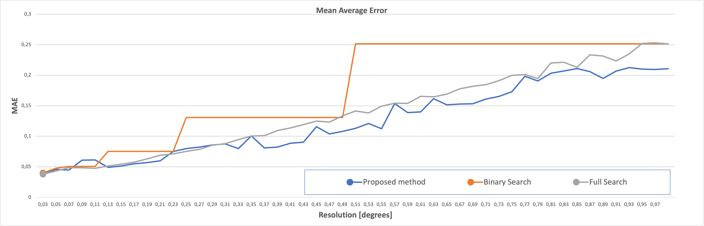
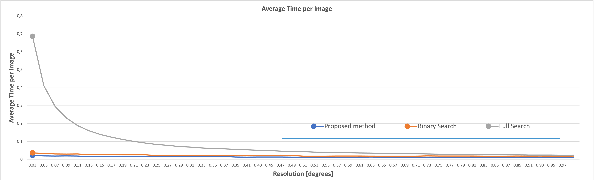

# TabuVision

## Cíl projektu
Hlavním cílem projektu je vytvořit software umožňující s co nejvyšší úspěšností (a pokud možno v přijetelném výpočetním čase) extrahovat tabulky, obsahující relevatní finanční informace, z výkazů zisků a ztrát volně dostupných na webu Ministerstva spravedlnosti https://justice.cz/

## Postup
Celý postup se dá shrnout do 5 kroků:
1) Korekce orientace stránky
2) Detekce tabulky na stránce
3) Korekce skew tabulky (napřímení do horizontální polohy)
4) Detekce struktury tabulky (sloupce a řádky)
5) Rozpoznání textu uvnitř jednotlivých buněk tabulky

### Korekce orientace stránky

#### Dataset

Celý testovací dataset obrázků náhodně zrotovaných stránek je k dispozici zde: <a href="https://drive.google.com/drive/folders/1YPjvytkDtZQEkFvUhUW3zskW62ToO8WR?usp=drive_link" target="_blank">Rotation dataset</a>

Dataset obsahuje 6676 obrázků stránek. Obrázky stránek byly vytažené z PDF souborů výkazů zisků a ztrát stažených z webu Ministerstva spravedlnosti. Jednotlivé obrázky jsme manuálně prošli a zrotovali (o 0,90,180, nebo 270 stupňů) do standardní polohy. Poté jsme přidali náhodně kvadraturní rotaci (0,90,180, nebo 270 stupňů). Při rotaci jsme použili mediánový padding. Hodnotu rotace jsme uložili do jména obrázku (na konec).

Testovací dataset pro korekci orientace výřezů tabulek jsme se z důvodu nízké úspěšnosti PyTesseract modelu rozhodli neuvěřejňovat. 

#### Metoda
Pro korekci orientace stránky jsme nejprve vyzkoušeli PyTesseract (python wrapper pro Google Tesseract-OCR engine), konkrétně funkci `image_to_osd`. PyTesseract nakonec dosáhl tak excelentních výsledků, že nebylo potřeba ladit jiné (zpravidla co do úspěšnosti horší) modely na rozpoznávání orientace skriptu. Klíčové bylo správně obrázek předzpracovat. Vlivem správného předzpracování obrázku jsme docílíli zlepšení úspěšnosti o 13,45 procentních bodů (z 85,68% na 99,13%). Využívali jsme PyTesseract `image_to_osd` s Page Segmentation Mode 0 (PSM 0). Nejprve jsme zkoušeli vkládat nepředzpracované obrázky již vyříznutých tabulek. To se neosvědčilo. Poté jsme zkoušeli vkládat celé stránky různě předzpracované. Výsledky ukazuje následující tabulka.

| **PyTesseract (PSM 0)**                        | **accuracy [%]** |
|------------------------------------------------|------------------:|
| celé stránky (Sauvola - w = 15, k = 0.2, lang = ces)       | 99.13            |
| celé stránky (Sauvola - w = 15, k = 0.2)       | 99.10            |
| celé stránky (Sauvola - w = 15, k = 0.3)       | 98.97            |
| celé stránky (Sauvola - w = 15, k = 0.05)      | 98.90            |
| celé stránky (Sauvola - w = max(img_width,img_height), k = 0.2) | 98.15            |
| celé stránky (Sauvola) + korekce skew          | 96.97            |
| celé stránky (RGB) + korekce skew              | 94.12            |
| celé stránky (RGB)                             | 93.77            |
| celé stránky (Gaussian Blur 5x5 + Sauvola)     | 87.47            |
| výřezy tabulek (RGB)                           | 85.68            |

Kde Sauvola je metoda adaptivního prahování (w = window size, k = parametr metody), korekce skew znamená, že jsme stránku nejprve narovnali pomocí algoritmu projekčního profilování.

Testování probíhalo tak, že jsme přičetli +1 za každou správně uhodnutou rotaci pomocí Pytesseract `image_to_osd`. Accuracy pak vznikla jako počet správně predikovaných rotací / počet obrázků.

### Detekce tabulky na stránce

#### Datasety

##### PubTables1M - Detection
Jakožto dataset pro účely detekce tabulky v obrázku dokumentu jsme využili rozsáhlý dataset <a href="https://huggingface.co/datasets/bsmock/pubtables-1m/tree/main" target="_blank">PubTables1M-Detection</a> čítající 575305 obrázků stránek dokumentů, ve kterých jsou anotovány tabulky ve formě bounding boxů do dvou tříd "table" a "rotated_table". Obrázky jsou sesbírané především z věděckých článků. Obrázky a anotace z tohoto datasetu jsou rozděleny na train/val/test v poměru 460589/57591/57125 vzorků. Tento dataset jsme využili k předtrénování některých table detection modelů. Takto předtrénované modely jsou později označeny v tabulce vyhodnocení odelů jako "fine-tuned".

##### Náš dataset
Jako druhý dataset jsme manuálně anotovali tabulky v 6676 obrázcích, které jsme získali ze stažených výkazů zisků a ztrát ze stránek Ministerstva spravedlnosti https://justice.cz/ - stejné obrázky jako při testování modelů na korekci rotace. Tyto výkazy jsou PDF dokumenty obsahující naskenované stránky výkazů nebo stránky v digitální podobě. Tabulky jsme anotovali v prostředí CVAT pomocí bounding boxů a jednou třídou "table". Zhruba 10-20% obrázků v datasetu neobsahuje žádnou tabulku.

Dataset je k dispozici zde: <a href="https://drive.google.com/drive/folders/1hhcZgzQTpxSs7YufF3XzcvXPFtPGMIg8?usp=drive_link" target="_blank">Náš dataset</a>

#### Metody

##### Klasické metody zpracování obrazu
Prvně jsme se pokusili detekovat tabulky pomocí klasických metod zpracování obrazu. K segmentaci textu a mřížky tabulky jsme využili metodu Sauvola adaptive thresholding. Dále jsme pak potřebovali extrahovat mřížku tabulky. Předpokládali jsme, že tabulka má mřížku a samotná tabulka je dokonale narovnána do standardní polohy (bez žádné rotace ani skew). Poté jsme použili morfologický opening s vektory jedniček 1x40 a také 40x1. Tyto dva výstupy z openingů jsme pak zkombinovali do jednoho výstupu pomocí bitového OR (sjednocení bílých pixelů). Následně jsme pak pomocí funkce `findContours` z OpenCV našli externí kontury a těm určili minimální ohraničující obdélník. Tento obdélník jsme pak považovali za bounding box tabulky s třídou "table". Výrazným omezením této metody jsou předpoklady dokonale standardní orientace tabulky a také, že tabulky obsahuje mřížku. Takové tabulky se ovšem v datasetu vyskytují zřídka (odhadem 30% tabulek).

##### Metody založené na hlubokém učení
Vyzkoušeli jsme celkem 4 architektury modelů standardně používané pro Object detection úkoly. Jsou to YOLOv8 Medium, YOLOv11 Large, RT-DETR Large od Ultralytics a Faster-RCNN z balíčku detectron2. Následující tabulka ukazuje výsledné srovnání table detection modelů.

| **name**                                     | **average IoU [%]**      | **average inference time [ms]** |
|----------------------------------------------|--------------------------:|---------------------------------:|
| YOLOv11 Large                                | 94.87 ± 11.08            | 396                             |
| **YOLOv8 Medium**                            | **94.85 ± 11.11**        | **284**                         |
| fine-tuned YOLOv8 Medium (no freeze)         | 94.71 ± 11.42            | 293                             |
| fine-tuned YOLOv11 Large (no freeze)         | 94.70 ± 12.44            | 378                             |
| fine-tuned YOLOv11 Large (freeze 5)          | 94.19 ± 14.43            | 405                             |
| RT-DETR Large                                | 94.12 ± 11.82            | 1239                            |
| fine-tuned RT-DETR Large (no freeze)         | 93.68 ± 12.45            | 1219                            |
| YOLOv8 Medium (binary)                       | 93.40 ± 11.43            | 286                             |
| fine-tuned faster-RCNN (freeze backbone)     | 50.40 ± 25.94            | 805                             |
| fine-tuned faster-RCNN (no freeze)           | 49.66 ± 25.07            | 776                             |
| Sauvola + Morphology                         | 23.13 ± 31.50            | 314                             |

YOLOv8 Medium (binary) je model učený na Našem datasetu ale předtím prahovaném Sauvola metodou.

Testovací dataset obsahuje náhodně vybraných 10% obrázků z původního datasetu 6676 obrázků. Tedy 670 testovacích obrázků (508 obrázků s GT boxy) a celkem tedy 633 GT boxů. Prediction a GT bounding boxy jsou spárovány pomocí Greedy (Naive) matching algoritmu a je vypočítáno IoU takto vzniklých dvojic. Ke každému Prediction bounding boxu se tak najde jeho dvojice mezi GT bounding boxy a napočítá se IoU. Z těchto IoU se pak vypočítá průměr a std. Dále se měří průměrný čas inference modelu s jedním obrázkem.

Z testování jsme vybrali jako nejlepší model YOLOv8 Medium, který byl trénován pouze na Našem datasetu. YOLOv11 Large je sice v průměru o 0,02 procentního bodu lepší, ale jeho průměrný čas inference s jedním obrázkem je výrazně vyšší.

### Korekce skew tabulky (napřímení do horizontální polohy)

#### Dataset
Celý testovací dataset obrázků stránek s náhodným skew je k dispozici zde: <a href="https://drive.google.com/drive/folders/1aXV55ico1ymYOPBirWvxImXHgu1_utLr?usp=drive_link" target="_blank">Skew dataset</a>

Dataset obsahuje celkem 5000 obrázků náhodně vybraných z <a href="https://huggingface.co/datasets/bsmock/pubtables-1m/tree/main" target="_blank">PubTables1M-Structure</a>. U nich jsme předpokládali, že jsou v dokonale horizontální poloze. Přidali jsme jim tedy náhodný skew z generovaný z Normálního rozdělení N(0,3). Při rotaci jsme použili mediánový padding. Tuto hodnotu skew jsme zároveň uložili do názvu obrázku (na konec).

#### Metody
Běžně používané metody pro detekci skew jsou Hough Transform, Randon Transform a nebo zjednodušená analogie Radon Transform, projekční profilování (PP). Právě poslední metodu jsme využili. Metoda je schopna určit úhel skew s libovolnou přesností. Problém u této metody je, že s vyšší přesností roste její výpočetní náročnost. Proto je potřeba využít nějakého prohledávacího algoritmu, který minimalizuje počet prohledávaných úhlů. Přišli jsme s vlastním prohledávacím algoritmem, který je podobný Fibonacci Search algoritmu, ale místo Fibonacciho posloupnosti využívá geometrickou. Tento algoritmus analyticky minimalizuje počet prohledávaných úhlů. Jeho teoretické odvození se sepsáno výše v PDF souboru `Skew_detection_algorithm.pdf`. Tento algoritmus je rychlejší než Binary search algoritmus a častokrát dokonce přesnější než Full search algoritmus, který prohledává všechny úhly na daném rozlišení. Následují dva grafy srovnání úspěšnosti pomocí metriky MAE (Mean Absolute Error) a pak graf celkového času inference jednoho obrázku. Oba v závislosti na požadovaném rozlišení (při prohledávání celkového rozsahu od -10 do 10 stupňů skew). 

Z grafů plyne, že náš algoritmus je při požadovaném rozlišení 0.03 stupně 38 krát rychlejší než Full Search algoritmus a 1.6 krát rychlejší než Binary Search algoritmus.
### Detekce struktury tabulky (sloupce a řádky)

### Rozpoznání textu uvnitř jednotlivých buněk tabulky

#### Dataset
Pro rozpoznání textu jsme udělali vlastní dataset, kde jsme z tabulek Našeho datasetu výkazů zisků a ztrát vyřízli buňky pomocí našeho výsledného modelu pro detekci struktury a tyto buňky manuálně olbelovali. K tomu jsme si vytvořili labelovací nástroj dostupný zde: <a href="https://drive.google.com/drive/folders/1an-eLrnwONomA2d6fbbfuQPfmFNnhuhf?usp=drive_link" target="_blank">Datasety</a> pod názvem `LabellingGUI.py`. Dataset pak obsahuje složku `images`, kde se nachází 798 obrázků výřezů a pak složku `labels`, kde jsou jim příslušné textové soubory obsahující text, který je na obrázku napsaný.

#### Metody
Uvažovali jsme celkem 4 metody: PyTesseract, EasyOCR, PaddleOCR, naše vlastní OCR. EasyOCR má velkou nevýhodu, že je optimalizovaná pro GPU a na CPU je velmi pomalá, proto jsme ji dále neuvažovali. Náš vlastní OCR (CNN feature extractor a LSTM) bohužel našem testovacím datasetu nebyl zdaleka tak dobrý jako zbylé dvě uvažované metody. Z tohoto důvodu jsme se rozhodli náš model pouze zmínit, ale nepřikládáme mu téměř žádnou relevanci. Vylepšování úspěšnosti našeho modelu by stálo ještě mnohem více úsilí a není vůbec žádná jistota, že bychom dosáhli lepších výsledků než PyTesseract. Náš model je pro inferenci dostupný <a href="https://drive.google.com/drive/folders/1v4kzYcdaMBcDAJdQIxtj708t2XIRvjcE?usp=drive_link" target="_blank">zde</a>. Do ušího výběru se pak dostaly metody PyTesseract a PaddleOCR. U obou metod opět mělo velký přínos sofistikované předzpracování obrázku, které nám samotné pomohlo vylepšit CER (Character Error Rate) z 8.88% (bez předzpracování) na výsledných 2.33% (s předzpracováním) s použitím PyTesseract OCR s configem PSM 6. S PaddleOCR jsme dosáhli nejlepší CER 9.5%. Výhoda PaddleOCR oproti PyTesseract je naopak 3x kratší průměrný inferenční čas s obrázkem (80ms - PaddleOCR vs 240ms - PyTesseract). Na základě vizuálního vyhodnocení chybných predikcí PyTesseract (predikce s nenulovou CER), PyTesseract selhává často v případech, kdy je část textu ořízlá (text není v obrázku plně viditelný). To není proto často chyba OCR modelu, ale modelu na detekci struktury tabulky. Vylepšení modelu na detekci struktury proto jistě povede ke zlepšení úspěšnosti OCR modelu.

Celé vyhodnocení je dostupné zde: <a href="https://drive.google.com/drive/folders/1JAqTkgyboK71otH2tUDVGiaHpi_XyXc_?usp=drive_link" target="_blank">Vyhodnocení OCR</a>

## Shrnutí
Celý funkční software je k dispozici v souboru `TabuVision.ipynb`

Pro trénování a testování jsme využívali <a href="http://2nasbyo.257.cz/" target="_blank">FJFI HELIOS cluster</a>, zejména NVIDIA Tesla V100 GPU. Dále pak MacBook M1 Pro.

## Odkazy
Většina použitých kódů je dostupná ke stažení zde: <a href="https://drive.google.com/drive/folders/1VXDQpVIAQ3XSNKVEbv4OpxZIaYCLkBbK?usp=sharing" target="_blank">TabuVision Codes</a>

